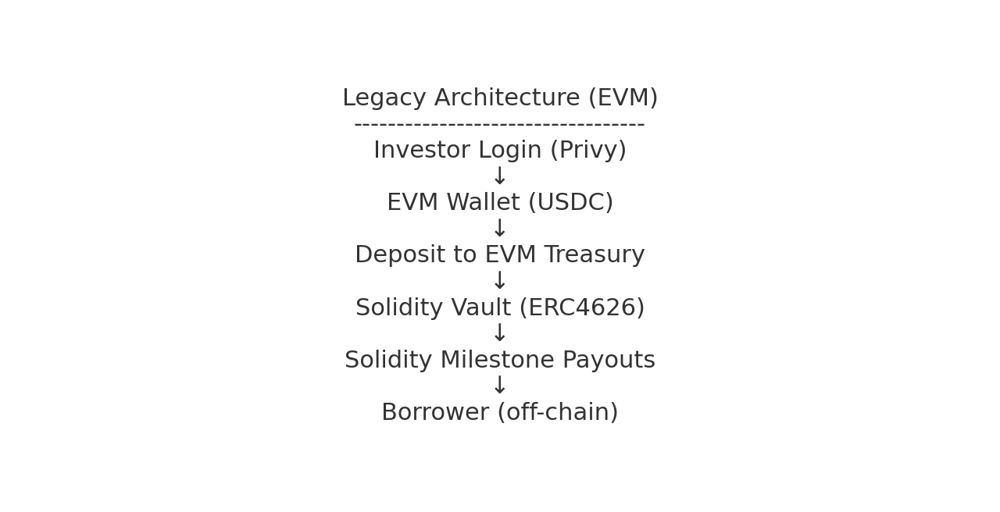
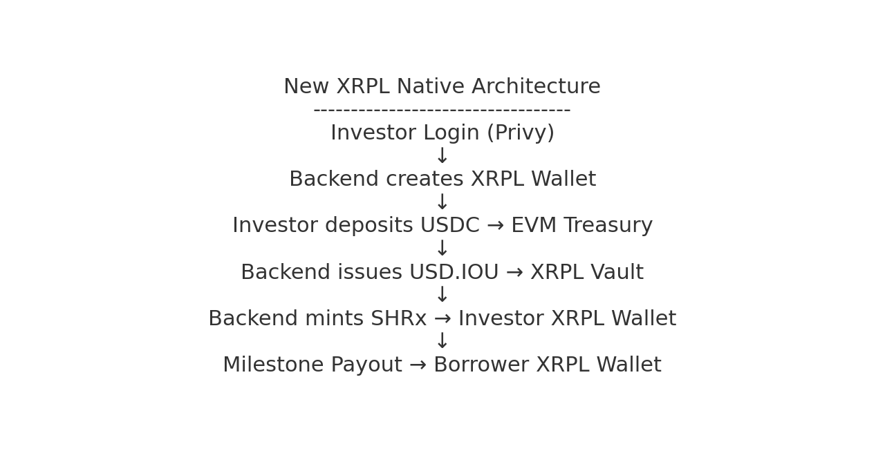

# TruMarket – XRPL Migration (Demo Day Technical Architecture)

## 1. Overview

TruMarket is transitioning from an EVM-based vault system (Solidity ERC4626) to a native XRPL settlement vault architecture designed to improve safety, reduce smart-contract risk, simplify accounting, and unlock fast cross-border settlement. XRPL now powers:

- USD liquidity custody (vault balances)
- SHRx share issuance
- Milestone payouts
- Deal metadata / NFTs
- Borrower settlements

USDC still onboards via EVM temporarily; once on/off-ramp partners (Iron, etc.) are live the flow becomes XRPL-only.

---

## 2. Legacy EVM Architecture

### Key Issues

- Complex Solidity vault (~1200 LOC)
- Smart-contract attack surface (reentrancy, maths, upgrades)
- No native multi-currency settlement
- Borrower payouts were off-chain
- Expensive audits, slow iteration

---

## 3. New XRPL-Native Architecture

### Why XRPL?

- Ledger primitives (IOUs, Payments, NFTs) replace smart contracts
- Native multi-currency settlement & FX (IOUs, AMM, Pathfinding)
- Instant payments across borders
- Transparent accounting (trustlines + AccountLines API)
- No bridges or custom Solidity—all mirroring handled by backend

---

## 4. What Is the XRPL Vault?

**XRPL Vault =**

✔ Dedicated XRPL account per deal  
✔ Holds USD.IOU via trustlines  
✔ Controlled by TruMarket issuer/treasury  
✔ Receives investor USD.IOU deposits (mirrored from USDC)  
✔ Sends milestone payouts via XRPL Payments  
✔ Immune to smart-contract exploits (no user code)

**Safety benefits:** no reentrancy, integer bugs, state desync, inflation exploits, or upgrade bugs—the ledger enforces rules.

---

## 5. XRPL Primitives in Use

- **Issued Currencies:** USD.IOU (treasury-backed), SHRx (deal shares)
- **Trustlines:** Auto-created for vaults, borrowers, investors
- **XRPL Payments:** Milestone payouts + USD.IOU redemption
- **XRPL Accounts:** Vault, borrower, investor, admin wallets
- **AccountLines API:** Balance and trustline queries for USD.IOU/SHRx

All primitives are native XRPL features—no custom smart contracts.

---

## 6. Cross-Chain Architecture (EVM ↔ XRPL)

1. Investor deposits USDC to the EVM DealVault (same UX as legacy)
2. Backend auto-detects the ERC20 transfer (cron job + viem)
3. Backend issues USD.IOU to the deal’s XRPL vault
4. Backend mints SHRx shares to the investor’s XRPL wallet
5. Milestone approval triggers XRPL Payment from vault → borrower
6. Redemption burns SHRx, returns USD.IOU (USDC return **pending**)

USDC never leaves EVM; XRPL mirrors balances 1:1 without bridges.

---

## 7. Current Blockers

| Blocker                            | Status         | Notes                                                                                                               |
| ---------------------------------- | -------------- | ------------------------------------------------------------------------------------------------------------------- |
| Redemption USDC return             | ⚠️ Partial     | SHRx burn + USD.IOU return live; final USDC transfer back to investor wallet still pending.                         |
| Balance reconciliation / hardening | ⚠️ Partial     | Auto-detect + mirroring works for demo; need persistent idempotency, audit logging, drift detection for production. |
| FX / off-ramping partners          | ❌ Not started | Integrations with Iron + global payout partners scheduled post-grant.                                               |

Everything else (wallet creation, trustlines, vault automation, deposit/mint flow, milestone payouts) is ✅ complete.

---

## 8. Roadmap

### ✅ Completed (Testnet Live)

- Automatic deposit detection → USD.IOU issuance → SHRx minting
- Per-deal XRPL vault + borrower accounts
- Automatic investor wallet creation & trustlines
- Milestone payouts (vault → borrower)
- Live XRPL Testnet demo (investor → vault → borrower)

### ⚠️ In Progress (Pre-Production)

- Finish USDC return leg of redemption flow
- Production hardening: encrypt wallet seeds, rate limiting, persistent idempotency, audit logging
- Integrate on/off-ramp partner (Iron) for automated payouts

### Post-Grant (1–2 Months)

- Iron + global off-ramp integrations (NGN/KES/ZAR/EGP/PHP/MXN)
- XRPL AMM / Pathfinding for multi-currency settlement
- Reduce dependency on EVM treasury (XRPL-native onboarding)

### Long-Term

- Full XRPL migration (EVM optional)
- RLUSD integration when available
- Additional XRP-ledger primitives (AMM, Escrow, Payment Channels) as needed

---

## 9. Investor Pitch – Why XRPL?

- Eliminates Solidity vault risk (no user contracts)
- Global settlement rails with native FX
- Instant payments, transparent balances
- No bridge custodians—backend mirrors state deterministically
- Aligns with Ripple ecosystem & partner roadmap

---

## 10. Demo Day Checklist ✅

- Technical architecture diagrams + explanation
- Live XRPL Testnet demo (deposit → payout; redemption XRPL side live)
- Clear roadmap & blockers with timelines
- Investor-ready story (problem, traction, why XRPL, ask)
- Feature flag (`USE_XRPL`) keeps EVM fallback available

This README matches the current implementation in `@trumarket-XRPL/` and is ready for Demo Day.
